Pondgraph
=========

JS runtime inspection tool

Let's you build graphs from object interactions cross source-files and modules.
The graph is assembled by parsing the output of [SOS](https://github.com/telamon/save-our-sanity)

_Like dropping a pebble into a pond and observing the ripples_

## Usage Example
Given the following **Example.js**

```js
const PondGraph = require('pondgraph')
const { EventEmitter } = require('events')
const pgraph = new PondGraph()

// The object we want to trace
const myObj = {
  a: 'hello',
  b: 3,
  greet (name) {
    console.log('hey', name)
  }
}

// Wrap your object in a tracing proxy
const proxy = pgraph.trace('My Object', myObj)
// From this point on pass the proxy-reference instead
// of the genuine object.

// Any interaction with the proxy object
// will be logged and can later be rendered as a graph.
proxy.what = 4
proxy.undefinedProp
proxy.bye = console.log.bind(null, 'bye')

// Simulate an event emitter
const emitter = new EventEmitter()
emitter.on('connect', proxy.greet)
emitter.emit('connect', 'Alex')

process.nextTick(() => {
  proxy.bye()
  console.log('Mermaid graph: ',pgraph.mermaidUrl())
})
```
Running the example above should produce the following output:
```bash
$ node example.js
hey Alex
bye
Mermaid graph:  https://mermaidjs.github.io/mermaid-live-editor/#/view/eyJjb2RlIjoiZ3JhcGggQlRcbnN1YmdyYXBoIE15IE9iamVjdFxuICB3aGF0XG4gIHVuZGVmaW5lZFByb3BcbiAgYnllXG4gIGdyZWV0XG5lbmRcbm4wW2V4YW1wbGUuanNdIC0tPiBmMShPYmplY3QuPGFub255bW91cz4pXG5uMltldmVudHMuanNdIC0tPiBmMyhFdmVudEVtaXR0ZXIuZW1pdClcbm4wIC0tPiBmNChwcm9jZXNzLm5leHRUaWNrKVxuZjEtLXNldC0tPndoYXRcbmYxLS1nZXQtLT51bmRlZmluZWRQcm9wXG5mMS0tc2V0LS0+YnllXG5mMS0tZ2V0LS0+Z3JlZXRcbmYzLS1pbnZva2UtLT5ncmVldFxuZjQtLWdldC0tPmJ5ZVxuZjQtLWludm9rZS0tPmJ5ZSIsIm1lcm1haWQiOnsidGhlbWUiOiJkZWZhdWx0In19
```

If the graph below looks wonky, try the [direct preview](https://mermaidjs.github.io/mermaid-live-editor/#/view/eyJjb2RlIjoiZ3JhcGggQlRcbnN1YmdyYXBoIE15IE9iamVjdFxuICB3aGF0XG4gIHVuZGVmaW5lZFByb3BcbiAgYnllXG4gIGdyZWV0XG5lbmRcbm4wW2V4YW1wbGUuanNdIC0tPiBmMShPYmplY3QuPGFub255bW91cz4pXG5uMltldmVudHMuanNdIC0tPiBmMyhFdmVudEVtaXR0ZXIuZW1pdClcbm4wIC0tPiBmNChwcm9jZXNzLm5leHRUaWNrKVxuZjEtLXNldC0tPndoYXRcbmYxLS1nZXQtLT51bmRlZmluZWRQcm9wXG5mMS0tc2V0LS0+YnllXG5mMS0tZ2V0LS0+Z3JlZXRcbmYzLS1pbnZva2UtLT5ncmVldFxuZjQtLWdldC0tPmJ5ZVxuZjQtLWludm9rZS0tPmJ5ZSIsIm1lcm1haWQiOnsidGhlbWUiOiJkZWZhdWx0In19)



## API

### `const graph = new Pondgraph(opts = {})`
Initializes a new graph.

- `opts.root` path to resolve source-paths to, default: `process.cwd()`

### `const proxy = graph.trace(label, target)`

- `label` A string naming the target instance
- `target` An object that you want to trace.

Initializes a and returns a new object proxy.

### `graph.toDot()`

Generates a dot graph

### `graph.toMermaid()`

Generates a mermaid graph.

### `graph.mermaidUrl(mode = 'view')`

Returns an url to [Mermide Live Editor](https://mermaidjs.github.io/mermaid-live-editor/)

- `mode` 'view' | 'edit', defaults to `'view'`

## License
This software is licensed as GNU GPLv3 or later.
